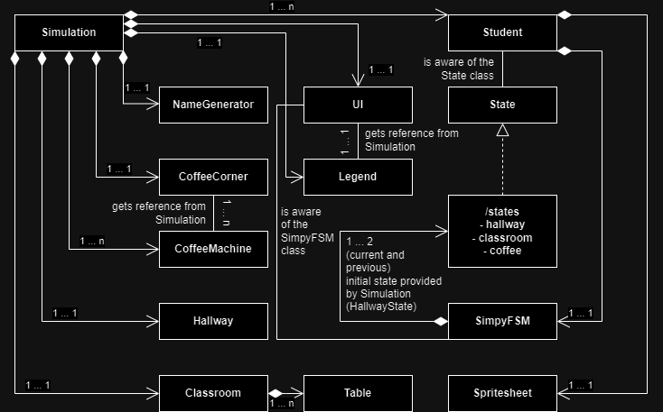

[](https://classroom.github.com/a/c7vtEsEG)
# Auteur
Naam:Johan Dada

Studentnummer:1856417


# Schoolsim
Dit is een discrete event based simulatie die gebruik maakt van onder andere de libraries simpy en pygame. Het gedrag 
van de agenten in de omgeving kan gemodelleerd worden met behulp van een finite state machine.

# Installatie

Download en installeer Anaconda (https://www.anaconda.com/download) op je systeem, als je dat nog niet gedaan hebt.

Open Anaconda Prompt (lees: de terminalvariant van Anaconda), navigeer naar de directory van dit project en voer uit: 

```conda env create -f sim.yaml```

Daarna kun je je nieuwe omgeving inladen via diezelfde Anaconda Prompt en de code opstarten:

```conda activate sim```

```python main.py```

Als je gebruik maakt van een IDE, zorg er dan voor dat je nieuw aangemaakte Conda-omgeving geactiveerd is als interpreter. We geven hier instructies voor de twee meest voorkomende IDE's onder studenten.

Voor Visual Studio Code:
- Toets Ctrl-Shift-P (of equivalent) in met main.py open;
- Toets "Interpreter" in de zoekbalk en selecteer "Python: Select Interpreter";
- Als je de "sim"-omgeving niet al ziet onder de interpreters, klik dan op het "Verversen"-icoontje rechts bovenin de zoekbalk;
- Selecteer de "sim"-omgeving.

Voor PyCharm:
- Open de map met het project erin;
- Ga naar Main > Settings > Project: (projectnaam) > Project Interpreter > Add Interpreter;
- Selecteer Conda Environment. PyCharm gaat nu even zoeken naar alle beschikbare environments;
- In de dropdown naast "Use existing environment:" zou je "sim" moeten kunnen kiezen;
- Kies OK in alle vensters.

Het staat je vrij om te ontwikkelen in andere omgevingen, maar wees je ervan bewust dat wij je waarschijnlijk minder goed kunnen helpen als je tegen issues aanloopt.

# Grafische omgeving
De grafische omgeving is gedefinieerd in de file config.yaml en wordt getekend met behulp van sprites en de Pygame-library.

# Loggen
Loggen is een geavanceerdere vorm van printen. Het is hierdoor mogelijk bijvoorbeeld andere prints te draaien wanneer je 
debugt, test of in productie draait zonder dat je daar logica in je code voor hoeft te gebruiken waardoor je code minder
overzichtelijk wordt. De configuratie van de logger staat ook in config.yaml (onderaan).
Voor meer informatie over hoe je de logger kan gebruiken zie: https://docs.python.org/3/howto/logging.html

# Code architecture


Class diagram (without attributes or methods) of the program.
Omitted here: the methods and class in Util.py.


# vraag D
de studeten beginnen als eerste in de hallway ,als de oude state was coffeeState dan gaan 
naar classroomstate zo niet dan naar coffestate en 
vanuit de coffestate gaat naar de hallway vandaar gaat naar de classroomstate want dan de oude state is coffestate